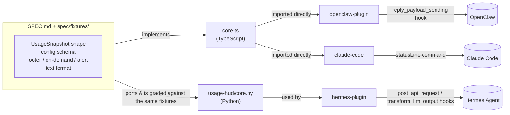

<div align="center">

# usage-hud

**A usage & context HUD for chat-based AI agents.**
Real-time context-window size and remaining usage, surfaced into Telegram/Discord/Slack.

[](https://github.com/Roizlotolov/usage-hud/actions/workflows/ci.yml)
[](LICENSE)
[](package.json)
[](packages/hermes-plugin)
[](CONTRIBUTING.md)

for [OpenClaw](https://github.com/openclaw/openclaw) · [Hermes Agent](https://github.com/NousResearch/hermes-agent) · [Claude Code](https://code.claude.com)

</div>

## Install

```bash
git clone https://github.com/Roizlotolov/usage-hud.git
cd usage-hud
```

That's the whole prerequisite — each host below tells you exactly what else it needs (some need a build, Hermes doesn't need anything more).

## Quick start

Pick your host.

### OpenClaw

```bash
npm install && npm run build

openclaw plugins install ./packages/openclaw-plugin --link
openclaw plugins enable usage-hud
openclaw gateway restart
```

Then add this to your OpenClaw config — required, a non-bundled plugin needs explicit opt-in to receive the hook this reads:

```jsonc
{
  "plugins": {
    "entries": {
      "usage-hud": {
        "enabled": true,
        "hooks": { "allowConversationAccess": true }
      }
    }
  }
}
```

All config options (footer fields, alert thresholds, the `/quota` command): [`packages/openclaw-plugin/README.md`](packages/openclaw-plugin/README.md).

### Hermes Agent

```bash
cp -r packages/hermes-plugin/usage-hud ~/.hermes/plugins/usage-hud
hermes plugins enable usage-hud
hermes gateway restart   # only needed if the gateway is already running
```

No build step, no npm — it's a plain Python plugin. Config is env vars, e.g. `USAGE_HUD_ALERT_CONTEXT_THRESHOLD_PCT` — see [`examples/hermes-env.sh`](examples/hermes-env.sh) and [`packages/hermes-plugin/README.md`](packages/hermes-plugin/README.md).

### Claude Code

```bash
npm install && npm run build
pwd   # copy this — you need the absolute path below
```

Add to `~/.claude/settings.json`, replacing `/absolute/path/to/usage-hud` with the `pwd` output above:

```json
{
  "statusLine": {
    "type": "command",
    "command": "node /absolute/path/to/usage-hud/packages/claude-code/scripts/statusline.mjs"
  }
}
```

For the on-demand skill, copy `packages/claude-code/skills/usage/` into `~/.claude/skills/` and edit the path inside its `SKILL.md`. Telegram alert setup and full details: [`packages/claude-code/README.md`](packages/claude-code/README.md).

## The problem

When you talk to a self-hosted AI agent through a normal chat app, you lose
the HUD a native app gives you. You can't see, in real time:

1. **Context size** — how full the model's context window is. When it fills,
   the agent silently compacts and starts "forgetting."
2. **Remaining usage** — tokens, dollars, or provider quota left. What stops
   an always-on agent from quietly burning money overnight.

These agents run 24/7 unattended — scheduled jobs, browser automation,
sub-agents — so the spend and context-bloat happen while you're not looking,
and your only interface is a chat bubble with no meter.

## What this is (and isn't)

All three hosts **already compute** tokens, context %, and cost — they just
don't surface it outside a terminal, and they don't warn you proactively. So
this is a **bridge**, not a metering engine: it reads numbers the host
already produced, formats them consistently, and (where the host allows it)
pushes a warning before something goes wrong. It never re-implements a
tokenizer or a pricing table.

Three surfaces, each independently toggleable:

| Surface | What it is |
|---|---|
| **Footer** | A usage line appended to the agent's replies |
| **On-demand** | A command/skill that reports current usage on request |
| **Alerts** | A proactive warning when context or budget crosses a threshold |

## Architecture

There is no single importable library, because the three hosts are three
different languages and expose completely different extension APIs. What's
shared is a **spec**, not a runtime:



`spec/fixtures/*.json` are golden input→output vectors. Both `core-ts` and
`hermes-plugin/usage-hud/core.py` are graded against the *same* fixture set,
so the TypeScript and Python implementations can't silently drift apart —
see [`SPEC.md`](SPEC.md) §5 (Conformance).

```
packages/
├── core-ts/           TypeScript core: UsageSnapshot, formatting, threshold/alert engine
├── openclaw-plugin/   OpenClaw plugin (TypeScript, imports core-ts directly)
├── hermes-plugin/     Hermes Agent plugin (Python — a straight port of core-ts, graded against the same fixtures)
└── claude-code/       Claude Code statusline script + skill (TypeScript, imports core-ts directly)
```

See [`DESIGN.md`](DESIGN.md) for the full research trail and architecture rationale.

## Verification methodology

Every host integration here was built by installing or cloning the **real,
currently-published** package and reading its actual source and bundled
docs — not by trusting a single research pass. That process caught several
real, load-bearing corrections along the way:

- **OpenClaw**: confirmed from the real `openclaw@2026.6.11` npm package (installed as a devDependency and type-checked against) that `scheduleSessionTurn`/`sendSessionAttachment`/`api.runtime.state` are **bundled-plugin-only** — a third-party plugin cannot use them. The alert design was built around that constraint, not against a hopeful assumption.
- **Hermes**: cloned `NousResearch/hermes-agent` and found that a plugin's `register_command` handler receives **no session identity at all**, that `agent.session_id` is **not** a platform `chat_id`, and that `PluginContext` has **no config-passing mechanism** — three real bugs an assumption-based build would have shipped.
- **Claude Code**: re-fetched the current official docs during implementation and found hook input **does not carry `context_window`/`cost`/`token_usage` at all**, which the original plan assumed it did. The alert mechanism was rearchitected around the statusline script — the one place that verifiably has this data — instead of a hook that can't see it.

Each package's README documents its own findings in full, with the exact source files read.

## What it actually looks like

A footer, from a real test run of the OpenClaw mapping against the shared fixtures:

```
— claude-opus-4-8 · in 1200/out 340 (cache 500) · ctx 41% · $0.0187 · Claude weekly 62% left
```

An on-demand reply:

```
Model: claude-opus-4-8
Tokens: in 1200 / out 340 (cache 500)
Context: 41% (41000 / 100000)
Cost: $0.0187 this turn ($1.42 session)
Quota: Claude weekly 62% left
```

An alert:

```
⚠️ Context alert: context window at 85% (≥ 80%)
⚠️ Budget alert: Claude weekly at 15% left (≤ 20%)
```

The Claude Code statusline script produces the footer format live, verified
against real mock input matching the official JSON schema:

```
$ echo '{"session_id":"test","model":{"id":"claude-opus-4-8"}, ...}' | node packages/claude-code/scripts/statusline.mjs
— claude-opus-4-8 · in 8500/out 1200 (cache 2000) · ctx 8% · $0.0187
```

## Development

```bash
npm install
npm run build   # builds core-ts, openclaw-plugin, and claude-code
npm test        # runs the fixture-conformance suite + unit tests for all three Node packages
```

Hermes plugin tests run separately (pure Python, no Node dependency):

```bash
cd packages/hermes-plugin && python3 -m unittest discover -s test -v
```

CI runs both on every push and PR — see [`.github/workflows/ci.yml`](.github/workflows/ci.yml).

## Contributing

Issues and PRs welcome — see [`CONTRIBUTING.md`](CONTRIBUTING.md) for the ground rules (the short version: verify against the real host before relying on an API, and keep the two `core` implementations in sync). This project follows the [Contributor Covenant](CODE_OF_CONDUCT.md). Security issues: see [`SECURITY.md`](SECURITY.md).

## License

[MIT](LICENSE) — this is a set of plugins talking to each host over its own
public extension API; it isn't a derivative work of any of them.
